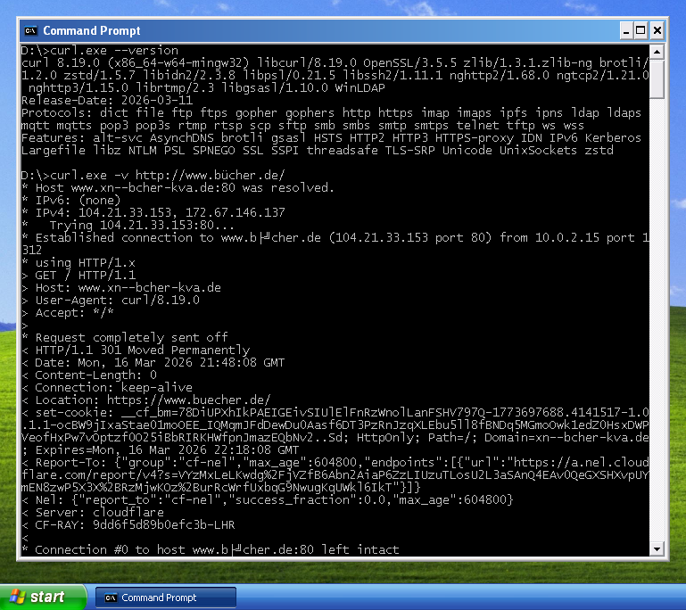

# cURL Windows

Build script to create fully-static binaries of [**cURL**](https://curl.se/) for Windows.

These builds provide full Unicode support as well as support for TLS 1.3, HTTP/2, HTTP/3 (QUIC), SSH-2 and IDN.

Resulting binaries run on Windows XP (SP-3) or later. 64-Bit binaries require Windows XP x64 Edition.



## Prerequisites

This build script is based on [**MinGW-w64**](https://www.mingw-w64.org/) and [**MSYS2**](https://www.msys2.org/).

### Detailed install instructions:

1. Install the MSYS2 base-system using the installer (i.e. `msys2-x86_64-yyyymmdd.exe`) from the website:  
   <https://repo.msys2.org/distrib/x86_64/>

    **Important:** If MSYS2 was installed to a directory other than `C:\msys64`, the variable `MSYS2_DIR` in `make.cmd` must be edited accordingly!

2. Once the MSYS2 base-system has been installed, updated all packages to the latest version:
   ```
   $ pacman -Syyuu
   ```

   **Note:** After the first update, close and re-open the MSYS2 terminal, then run the same command *again*!

3. Now install the 32-Bit *and* 64-Bit MinGW-w64 tool-chains:
   ```
   $ pacman -S --noconfirm mingw-w64-i686-toolchain mingw-w64-x86_64-toolchain
   ```

   (Be sure to **not** install the "UCRT" variants of these tool-chains, but the "traditional" MSVCRT-based ones!)

4. Finally install the "base" development tools, CMake *and* ZIP:
   ```
   $ pacman -S --noconfirm --needed base-devel cmake zip
   ```

## Build instructions

In order to build the 32-Bit *and* 64-Bit cURL packages, just run **`make.cmd`** from the cURL Windows base directory!

Optionally, you can build *only* the 32-Bit or 64-Bit package:

1. Open either the *32-Bit* (`mingw32.exe`) or the *64-Bit* (`mingw64.exe`) MSYS2 terminal

2. Change the working directory to the cURL Windows base directory (i.e. where `build.sh` is located)

3. Now run the **`./build.sh`** script!

## MSYS2 MinGW-w64 Warning

Recently, I noticed that my cURL binaries would crash with an “illegal instruction” (0xC000001D) exception, at seemingly random places, on one of my test machines. As it turned out, the offending instruction was an SSE instruction. This **should** be impossible, because I compile cURL and *all* of the required dependencies strictly with the [`-march=i586`](https://gcc.gnu.org/onlinedocs/gcc-15.1.0/gcc/x86-Options.html#x86-Options-1) option &ndash; which instructs the compiler to generate code that runs on the original Intel Pentium CPU, or any newer processor. Certainly, this means that the compiler **must not** generate any SSE instructions, or instructions from an even newer instruction set extension! So, what the heck was going on here?

After many hours of debugging, I was able to figure out the [culprit](msys2-mingw32-illegal-instruction-in-runtime.png): Apparently the MSYS2 project is shipping their MinGW-w64 compiler with a *pre-compiled* **runtime** library that uses SSE instructions; they actually optimize for a “Pentium 4” target, therefore enabling SSE and SSE2 instructions. That alone would be fine, if they had guarded the SSE-optimized code paths with some sort of runtime CPU detection. But this is **not** the case! Instead, their *runtime* library is trying to execute SSE-optimized code, regardless of whether the CPU actually supports this. This will cause the executable to [**crash**](msys2-mingw32-illegal-instruction-in-runtime.png), if the CPU does **not** happen to support SSE and SSE2. And, to make things very clear: We are **not** talking about some *optional* library here. Or one that could easily be compiled by yourself. The *runtime* library is an *integral* part of the C compiler, and it will *implicitly* be linked into the generated executable files. Without the *runtime* library, we can **not** have a “working” executable. Consequently, by shipping a *runtime* library that ***unconditionally*** forces SSE code into your executable file, they completely obliterate the purpose of the `-march` compiler option! In other words, targeting any CPU without SSE and SSE2 support becomes impossible 😟

The worst thing about all of this is that the **breaking** change in MSYS2's MinGW-w64 *runtime* happened silently (TTBOMK) and came totally unexpectedly for me. I was able to pin down the time of the *fatal* change to some point between June and July 2025, because my cURL build from early June 2025 was **not** effected by this issue yet; the problems first showed up when I tried to create the July 2025 build. Note that this happened after things had been working fine since at least 2018! Of course, I have reported my findings to the MSYS2 team immediately, but my ticket was closed with *“won't fix”* right away &ndash; so much about that. Furthermore, because MSYS2 is a *rolling release* distribution and because they do **not** provide a proper way to revert your installation to an earlier snapshot, there is **no** way to get a “working” MinGW-w64 compiler from MSYS2, if you need to support older CPUs 🤷

### WinLibs GCC to the rescue ?!

As a workaround, I found that, at the time of this writing, the MinGW-w64 compiler from [**WinLibs**](https://winlibs.com/) project does **not** exhibit this problem, and it can be integrated relatively easily into the MSYS2 shell:
* [winlibs-i686-posix-dwarf-gcc-15.1.0-mingw-w64msvcrt-13.0.0-r2.7z](https://github.com/brechtsanders/winlibs_mingw/releases/download/15.1.0posix-13.0.0-msvcrt-r2/winlibs-i686-posix-dwarf-gcc-15.1.0-mingw-w64msvcrt-13.0.0-r2.7z)
* [winlibs-x86_64-posix-seh-gcc-15.1.0-mingw-w64msvcrt-13.0.0-r2.7z](https://github.com/brechtsanders/winlibs_mingw/releases/download/15.1.0posix-13.0.0-msvcrt-r2/winlibs-x86_64-posix-seh-gcc-15.1.0-mingw-w64msvcrt-13.0.0-r2.7z)

I have now extended my cURL build script to automatically pick up *WinLibs* MinGW-w64 compiler, if the environment variable **`WINLIBS_ROOT_PATH`** is set and it points to the *WinLibs* installation directory.

Please make sure that the following files exist for the build script to detect and use the WinLibs GCC compiler:
* `%WINLIBS_ROOT_PATH%\mingw32\bin\gcc.exe`
* `%WINLIBS_ROOT_PATH%\mingw64\bin\gcc.exe`

**Note:** Since the WinLibs package does not provide a `cc.exe`, you will need to *copy* the `gcc.exe` to `cc.exe` within the `mingw32\bin` and `mingw64\bin` directories, to make things work as expected.

## Acknowledgement

cURL has been created by Daniel Stenberg, daniel@haxx.se, and many contributors.

For details, see:  
https://curl.se/docs/copyright.html

