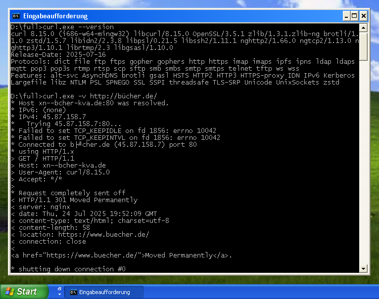

# cURL Windows

Build script to create fully-static binaries of [**cURL**](https://curl.se/) for Windows.

These builds provide full Unicode support as well as support for TLS 1.3, HTTP/2, HTTP/3 (QUIC), SSH-2 and IDN.

Resulting binaries run on Windows XP (SP-3) or later. 64-Bit binaries require Windows XP x64 Edition.



## Prerequisites

This build script is based on [**MinGW-w64**](https://www.mingw-w64.org/) and [**MSYS2**](https://www.msys2.org/).

### Detailed install instructions:

1. Install the MSYS2 base-system using the installer (i.e. `msys2-x86_64-yyyymmdd.exe`) from the website:  
   <https://repo.msys2.org/distrib/x86_64/>

    **Important:** If MSYS2 was installed to a directory other than `C:\msys64`, the variable `MSYS2_DIR` in `make.cmd` must be edited accordingly!

2. Once the MSYS2 base-system has been installed, updated all packages to the latest version:
   ```
   $ pacman -Syyuu
   ```

   **Note:** After the first update, close and re-open the MSYS2 terminal, then run the same command *again*!

3. Now install the 32-Bit *and* 64-Bit MinGW-w64 tool-chains:
   ```
   $ pacman -S --noconfirm mingw-w64-i686-toolchain mingw-w64-x86_64-toolchain
   ```

   (Be sure to **not** install the "UCRT" variants of these tool-chains, but the "traditional" MSVCRT-based ones!)

4. Finally install the "base" development tools, CMake *and* ZIP:
   ```
   $ pacman -S --noconfirm --needed base-devel cmake zip
   ```

## Build instructions

In order to build the 32-Bit *and* 64-Bit cURL packages, just run **`make.cmd`** from the cURL Windows base directory!

Optionally, you can build *only* the 32-Bit or 64-Bit package:

1. Open either the *32-Bit* (`mingw32.exe`) or the *64-Bit* (`mingw64.exe`) MSYS2 terminal

2. Change the working directory to the cURL Windows base directory (i.e. where `build.sh` is located)

3. Now run the **`./build.sh`** script!

## Acknowledgement

cURL has been created by Daniel Stenberg, daniel@haxx.se, and many contributors.

For details, see:  
https://curl.se/docs/copyright.html

